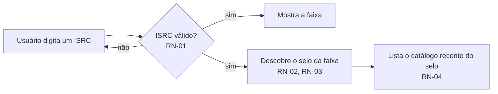
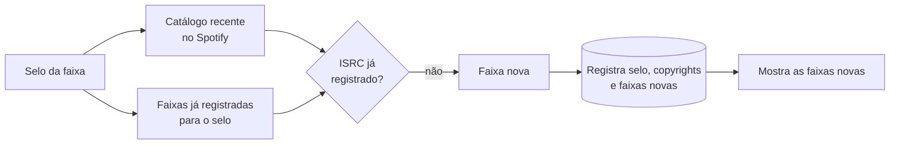
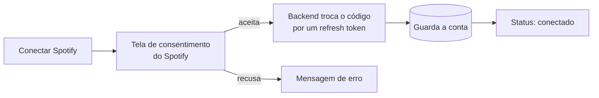
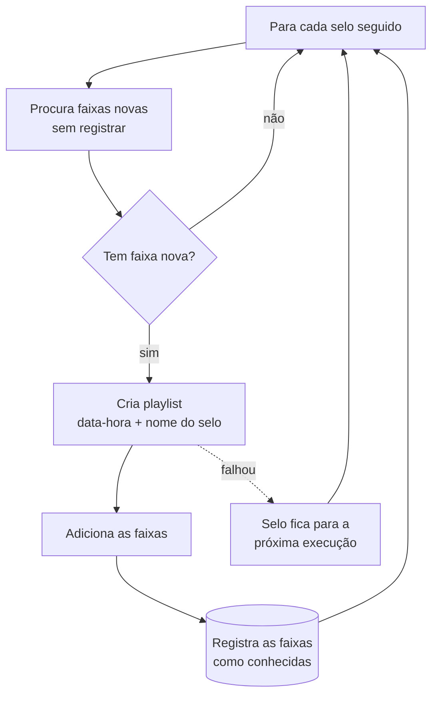

# label-follower — visão de negócio

> Documento de negócio: o que o sistema resolve, para quem, como é usado e quais regras ele aplica.
> Para arquitetura, API, dados e deploy, veja [tecnico.md](tecnico.md). Bugs conhecidos e o plano de
> melhorias estão em [bugs-e-melhorias.md](bugs-e-melhorias.md).
>
> Estado descrito: `master` em 2026-09-10 (após o #17). As regras abaixo foram levantadas do código —
> quando o comportamento atual é problemático, isso está sinalizado com um link para o bug.

## 1. O problema

Quem acompanha música eletrônica (e outros nichos) costuma seguir **selos** (gravadoras), não só
artistas. O Spotify não tem "seguir selo": para saber o que um selo lançou é preciso visitar a página
de cada lançamento, um por um. O label-follower automatiza isso:

1. descobre qual selo lançou uma faixa de que você gosta;
2. lista o que esse selo lançou recentemente;
3. lembra o que você já viu, para mostrar só o que é **novo**;
4. monta playlists no seu Spotify com as novidades de todos os selos que você acompanha.

## 2. Quem usa

É um app **pessoal e de usuário único**. Não existe cadastro nem login no app: há exatamente uma
conta Spotify "dona", conectada no backend, e é nela que as playlists são criadas (RN-09). Qualquer
pessoa que consiga abrir a URL do app usa essa mesma conta — veja [B10](bugs-e-melhorias.md#b10).

## 3. Glossário

| Termo | Significado no sistema |
|---|---|
| **ISRC** | Código internacional de 12 caracteres que identifica uma gravação (ex.: `GBEWA2205680`). É a chave de uma faixa no sistema. |
| **Faixa** | Uma gravação no Spotify: nome, ISRC e id do Spotify. |
| **Selo** (label) | A gravadora que lançou o álbum. No sistema, é identificada pelo **nome canônico** (o texto do campo `label` do álbum, limpo — RN-02). |
| **Copyright** | Textos de copyright do álbum (ex.: `2022 This Never Happened`). Servem para confirmar que um álbum é mesmo do selo, e não de outro com nome parecido. Um selo acumula vários ao longo do tempo. |
| **Catálogo recente** | Todas as faixas de álbuns do selo lançados depois do corte fixo de 2021-11-01 (RN-04). |
| **Faixa nova** | Faixa do catálogo recente que ainda não estava registrada para aquele selo (RN-05). |
| **Seguir um selo** | Estar registrado no banco. Acontece implicitamente na primeira vez em que você usa "Descobrir faixas novas" para ele (RN-07). |
| **Consolidar** | Rodar a descoberta para **todos** os selos seguidos e criar playlists com o resultado (RN-08). |

## 4. Jornadas

### J1 — Explorar um selo a partir de uma faixa

Tela **Explorar** (`/introspect`). Só leitura: nada é gravado.

### J2 — Descobrir faixas novas (e passar a seguir o selo)

Botão **Descobrir faixas novas** na tela Explorar. **Grava no banco.**

Na primeira vez que um selo passa por aqui, **todo** o catálogo recente é "novo" (RN-06), e o selo
passa a ser seguido (RN-07). Nas vezes seguintes, só aparece o que foi lançado desde a última descoberta.

### J3 — Conectar a conta do Spotify

Tela **Consolidar** → **Conectar Spotify**. Feito uma vez; o backend guarda a conexão (RN-09).

### J4 — Consolidar

Tela **Consolidar** → **Consolidar todas as gravadoras** (só aparece com a conta conectada).

O resultado não volta para a tela: ela só mostra "iniciado / concluído / erro". O detalhamento sai
no log do backend. As faixas só passam a "conhecidas" **depois** que a playlist do selo existe. Se algo
falhar num selo, as faixas dele continuam novas e voltam na próxima execução, e os outros selos
seguem normalmente ([B2](bugs-e-melhorias.md#b2), corrigido no #20).

## 5. Regras de negócio

| # | Regra | Onde no código |
|---|---|---|
| RN-01 | Uma faixa é identificada pelo **ISRC**. O frontend normaliza (maiúsculas, sem hífens e espaços) e só aceita o formato `^[A-Z]{2}[A-Z0-9]{3}\d{7}$`. O backend aceita qualquer texto. | `frontend/src/lib/isrc.ts` |
| RN-02 | O **selo de uma faixa** é o campo `label` do álbum do **primeiro** resultado da busca `isrc:` no Spotify, sem as palavras "records"/"recordings" (em qualquer caixa) e com espaços normalizados. Os **copyrights** do selo são os textos de copyright desse álbum, sem o ano do início (ex.: `2022 X` → `X`). | `SpotifyGateway.getLabel`, `SpotifyAlbum.toLabel` |
| RN-03 | Se já existe um selo registrado com o mesmo nome canônico, os copyrights registrados são **somados** aos do álbum. Assim o selo "aprende" variações de copyright. | `LabelIntrospector.getLabel` |
| RN-04 | O **catálogo recente** de um selo é formado por todos os álbuns que a busca `label:"<nome>"` do Spotify devolve (páginas de 50, no máximo 1000 resultados) e que satisfazem **as três** condições: (a) nome do selo do álbum **idêntico** ao nome canônico; (b) pelo menos um copyright compatível — um texto contém o outro, sem diferenciar maiúsculas; (c) data de lançamento **estritamente depois de 2021-11-01**. Entram todas as faixas desses álbuns. | `SpotifyGateway.getTracksFrom`, `Label.matches` |
| RN-05 | **Faixa nova** é uma faixa do catálogo recente cujo ISRC ainda não está vinculado ao selo no banco. | `LabelIntrospector.discoverNewTracksFrom` |
| RN-06 | **Descobrir** registra o selo (se for novo), seus copyrights e as faixas novas vinculadas a ele. A partir daí elas deixam de ser novas. Na primeira descoberta de um selo, todo o catálogo recente é considerado novo. | idem + `OurInfoGatewayImpl.saveTracks` |
| RN-07 | **Seguir é implícito**: todo selo registrado no banco é seguido. Não existe, pela interface ou pela API, uma forma de deixar de seguir. | `OurInfoGateway.getLabels` |
| RN-08 | **Consolidar** percorre todos os selos seguidos; para cada um com faixas novas, cria **uma playlist** chamada `<data-hora ISO-8601 UTC>-<nome do selo>` na conta conectada e adiciona as faixas em lotes de 5. Só **depois** disso as faixas passam a "conhecidas". Selos sem novidades não geram playlist. Se um selo falhar, as faixas dele continuam novas para a próxima execução e os demais selos seguem; ao final, a execução reporta erro listando os selos que falharam. O resultado vai para o log do backend. | `Consolidator`, `SpotifyUserPlaylistGateway` |
| RN-09 | Existe **uma única conta Spotify conectada**, mantida pelo backend com um refresh token guardado no banco. A conexão pede os escopos `playlist-modify-public` e `playlist-modify-private`. Desconectar apaga a conta guardada. | `SpotifyUserAuth`, `AuthController` |
| RN-10 | As leituras de catálogo (faixa, álbuns, busca por selo) usam a credencial **do app** (client credentials) e não dependem da conta conectada — Explorar e Descobrir funcionam sem conectar o Spotify. | `SpotifyAuth` |
| RN-11 | Faixa e selo são N:N (uma faixa pode estar em mais de um selo). ISRC e id do Spotify são únicos no banco: a mesma gravação é registrada uma vez só. | `db/migration/V1__init.sql` |

## 6. Limitações conhecidas (comportamento atual)

Estas são consequências das regras acima que afetam o resultado para quem usa. Detalhes técnicos e
correções propostas estão em [bugs-e-melhorias.md](bugs-e-melhorias.md).

- **Playlist repetida em caso raro**: se a playlist de um selo for criada mas o registro das faixas
  falhar, a próxima execução cria outra playlist com as mesmas faixas. É o preço de nunca perder
  lançamentos. Até o #20, uma falha no meio fazia as faixas sumirem ([B2](bugs-e-melhorias.md#b2)).
- **Faixas repetidas**: a mesma gravação lançada como single e no álbum aparece duas vezes na lista e
  na playlist — [B6](bugs-e-melhorias.md#b6). Confirmado em teste (9 de 163 faixas num selo real).
- **Um álbum "estranho" derruba o selo inteiro** (data só com o ano, álbum sem copyright) —
  [B4](bugs-e-melhorias.md#b4), [B5](bugs-e-melhorias.md#b5).
- **Lançamentos novos podem deixar de ser encontrados** se o copyright do selo trouxer o ano no meio
  do texto (ex.: `℗ 2023 Selo`) — [B11](bugs-e-melhorias.md#b11).
- **O "recente" nunca anda**: o corte é fixo em 2021-11-01, então cada Consolidar relê ~5 anos de
  lançamentos de cada selo — [B12](bugs-e-melhorias.md#b12).
- **O selo pode ser identificado errado** se o primeiro resultado da busca por ISRC for uma coletânea
  de outro selo — [B13](bugs-e-melhorias.md#b13).
- **Selos homônimos se misturam**: dois selos diferentes com o mesmo nome viram um só (a identidade é
  o nome, RN-02).
- **Uma playlist por selo a cada execução**, pública por padrão no Spotify — [B15](bugs-e-melhorias.md#b15).
- **Não há como deixar de seguir** um selo (RN-07) nem como ver a lista de selos seguidos pela interface.
