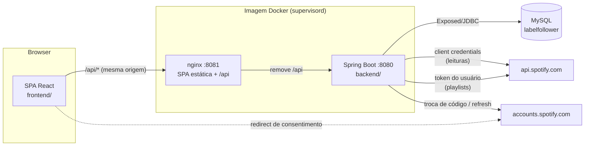
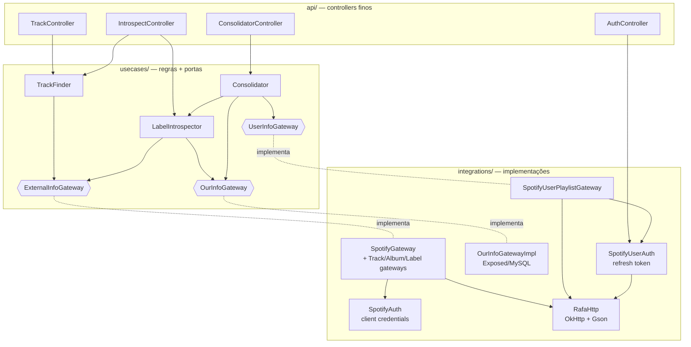
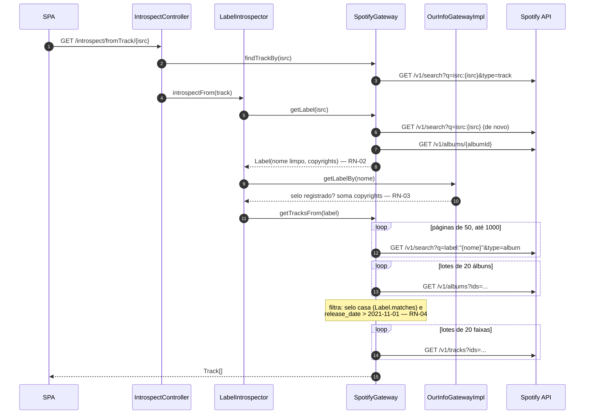
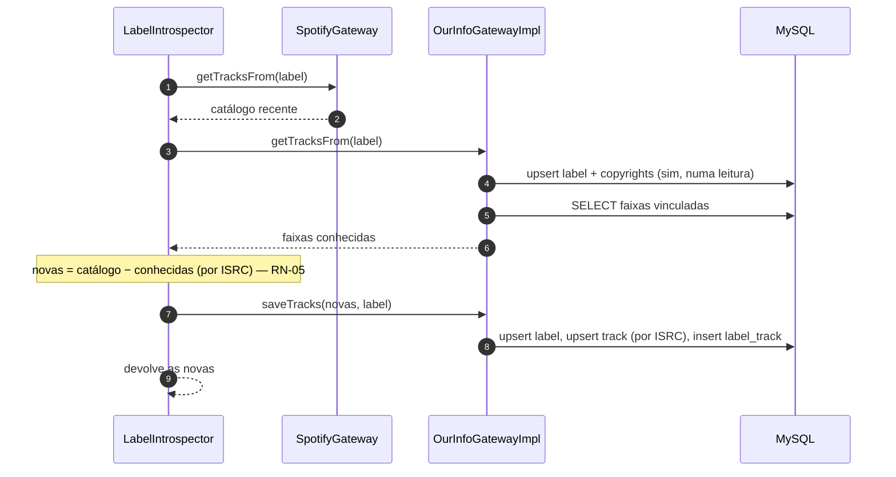
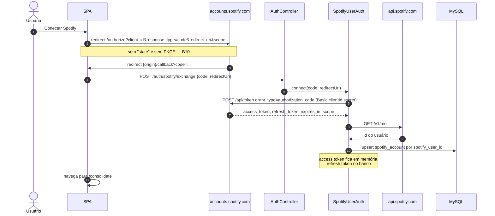
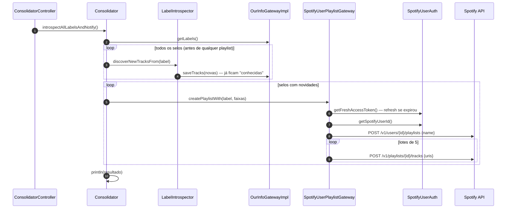
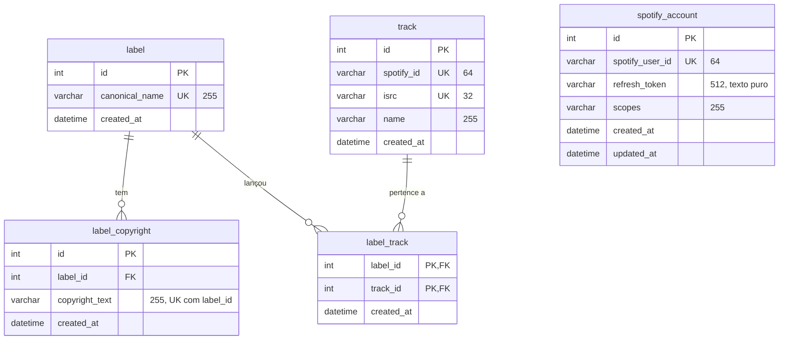

# label-follower — documentação técnica

> Arquitetura, API, fluxos, dados, integrações, configuração e deploy. As regras de negócio
> (RN-xx) estão em [negocio.md](negocio.md); bugs (Bxx) e o plano de melhorias em
> [bugs-e-melhorias.md](bugs-e-melhorias.md). Convenções de código: [DEVELOPMENT.md](../DEVELOPMENT.md)
> e [backend/DEVELOPMENT.md](../backend/DEVELOPMENT.md).
>
> Estado descrito: `master` em 2026-09-10 (após o #17), verificado na [seção 11](#11-estado-verificado-em-2026-09-10).

## 1. Visão geral

| Parte | Stack |
|---|---|
| Backend | Kotlin 2.2, Spring Boot 3.5 (Spring MVC), JDK 17 (compila para 17), OkHttp 4.12 + Gson, Exposed 1.0 (DAO + DSL), MySQL Connector/J 9.4 |
| Migrations | Flyway 12 (aplica) + Exposed migration (gera o SQL) |
| Frontend | React 19, Vite 6, TypeScript 5.7, TanStack Query 5, React Router 7, Tailwind 4 |
| Deploy | Uma imagem: `eclipse-temurin:17-jre` + nginx + supervisord; MySQL 9.4 à parte |
| Qualidade | Kotest 5.9 + MockK, Testcontainers (MySQL), detekt 1.23.8; `tsc` no front; GitHub Actions |

## 2. Backend — camadas

Módulo Gradle único, pacote `com.rafaelfo.labelfollower` (a estrutura plana é intencional —
[backend/DEVELOPMENT.md](../backend/DEVELOPMENT.md#architecture)).

- **Portas** (`ExternalInfoGateway`, `OurInfoGateway`, `UserInfoGateway`) ficam em `usecases/`, com
  nomes neutros; o nome "Spotify" só aparece em `integrations/spotify/`.
- `AuthController` é a exceção: fala direto com `SpotifyUserAuth` (não há porta para autenticação).
- `SpotifyUserAuth` também acessa o banco (`SpotifyAccountEntity`) diretamente, fora do `OurInfoGatewayImpl`.
- Modelos de domínio: `models/Track` (`name`, `isrc`, `spotifyId`) e `models/Label` (`name`,
  `copyrights`, e o casamento `matches` — RN-04).

## 3. API HTTP

Sem autenticação, sem CORS (o front chama sempre pela mesma origem). No Docker, o nginx expõe tudo
em `/api/*` e remove o prefixo; em dev, o proxy do Vite faz o mesmo.

| Método e rota | Entrada | Resposta de sucesso | Erros hoje |
|---|---|---|---|
| `GET /track/{isrc}` | ISRC no path | `200` `Track` | ISRC inexistente → `500` (`NoSuchElementException`) — [B7](bugs-e-melhorias.md#b7) |
| `GET /introspect/fromTrack/{isrc}` | ISRC | `200` `Track[]` — catálogo recente do selo (RN-04). **Não grava.** | idem; álbum problemático → `500` ([B4](bugs-e-melhorias.md#b4), [B5](bugs-e-melhorias.md#b5)) |
| `POST /introspect/newTracks/{isrc}` | ISRC | `200` `Track[]` — faixas novas (RN-05). **Grava** selo, copyrights e faixas. | idem |
| `POST /consolidate` | — | `200` sem corpo, só ao terminar tudo (síncrono) | sem conta conectada → `500`, **depois** de já ter gravado as faixas ([B2](bugs-e-melhorias.md#b2)); timeout do proxy ([B8](bugs-e-melhorias.md#b8)) |
| `GET /auth/spotify/status` | — | `200` `{ "connected": boolean }` — só verifica se há conta no banco | — |
| `POST /auth/spotify/exchange` | `{ "code", "redirectUri" }` | `200` sem corpo | código inválido → `500` com erro pouco claro ([B3](bugs-e-melhorias.md#b3)) |
| `DELETE /auth/spotify` | — | `200` sem corpo; apaga a conta guardada | — |

`Track` no JSON: `{ "name": string, "isrc": string, "spotifyId": string }` (camelCase, serializado
pelo Jackson do Spring). O espelho no front é `frontend/src/api/types.ts` — mudança de contrato
atualiza os dois lados no mesmo commit ([DEVELOPMENT.md](../DEVELOPMENT.md#cross-cutting-rule)).

Erros usam o corpo padrão do Spring Boot (`timestamp`, `status`, `error`, `path`). Em dev, o
devtools inclui `message` e `trace`; na imagem de produção, não — a UI acaba mostrando
"Internal Server Error".

## 4. Fluxos (sequência)

### 4.1 Explorar — `GET /introspect/fromTrack/{isrc}`

O front dispara `GET /track/{isrc}` em paralelo; os dois fazem a busca por ISRC.

Custo medido (selo com 50 álbuns): 16 requisições ao Spotify, ~8 s.

### 4.2 Descobrir — `POST /introspect/newTracks/{isrc}`

Mesmo começo do 4.1 (faixa → selo); depois:

### 4.3 Conectar o Spotify

### 4.4 Consolidar — `POST /consolidate`

A ordem dos dois loops é a causa do [B2](bugs-e-melhorias.md#b2): uma falha no segundo loop não
desfaz o que o primeiro gravou.

## 5. Modelo de dados

- Tabelas declaradas em `integrations/database/*Table.kt`, listadas em `AllTables.kt`.
- Schema versionado em `backend/src/main/resources/db/migration/V*.sql` (hoje só `V1__init.sql`).
  Datas são escritas pela aplicação a partir do `Clock` injetado, sem `DEFAULT` no banco.
- `spotify_account` deveria ter uma linha só (RN-09), mas nada impede uma segunda ([B9](bugs-e-melhorias.md#b9)).
- Collation padrão do MySQL 9 (`utf8mb4_0900_ai_ci`): a unicidade de `canonical_name` ignora
  maiúsculas e acentos no banco, enquanto o Kotlin compara nomes exatamente.
- Conexão: `Database.connect(url)` do Exposed, sem pool (uma conexão JDBC por transação).

### Workflow de migrations

1. Alterar o `*Table.kt` (e o `AllTables.kt`, se for tabela nova).
2. `./gradlew generateMigrationScript -Pname=V2__descricao` contra um banco já migrado → gera o `.sql`; revisar.
3. `./gradlew migrate` aplica localmente. Na imagem, `deploy/entrypoint.sh` roda o `MigratorKt` antes
   de subir o app (`baselineOnMigrate`, baseline em V1).
4. `MigrationSchemaTest` (Testcontainers) garante que migrations e tabelas não divergem.

## 6. Integração com o Spotify

### Duas credenciais

| | Client credentials (`SpotifyAuth`) | Usuário (`SpotifyUserAuth`) |
|---|---|---|
| Para quê | Leituras de catálogo (RN-10) | Criar playlists na conta dona (RN-09) |
| Como obtém | `POST accounts.spotify.com/api/token` `grant_type=client_credentials` | `authorization_code` uma vez; depois `refresh_token` |
| Onde guarda | Memória (token + expiração) | Refresh token no MySQL; access token em memória |
| Renovação | Quando expira (sem margem) | Quando expira (sem margem); grava novo refresh token se vier |

As duas usam `Authorization: Basic base64(clientId:clientSecret)` no endpoint de token. O client id é
público e está versionado; o secret vem de `SPOTIFY_CLIENT_SECRET`.

### Endpoints usados

| Endpoint | Uso | Lote/página |
|---|---|---|
| `GET /v1/search?type=track&q=isrc:{isrc}` | faixa pelo ISRC (usa o 1º resultado) | — |
| `GET /v1/albums/{id}` | álbum da faixa → selo | — |
| `GET /v1/search?type=album&q=label:"{nome}"` | álbuns do selo | 50 por página, offset até 1000 |
| `GET /v1/albums?ids=` | detalhes (selo, copyrights, data, faixas) | 20 ids |
| `GET /v1/tracks?ids=` | ISRC de cada faixa | 20 ids (a API aceita até 50) |
| `GET /v1/me` | id da conta conectada | — |
| `POST /v1/users/{id}/playlists` | cria a playlist (só `name`; pública por padrão no Spotify) | — |
| `POST /v1/playlists/{id}/tracks` | adiciona faixas | 5 URIs (a API aceita até 100) |

Todos os de leitura foram exercitados contra a API real em 2026-09-10 e responderam normalmente. Os
dois de playlist ainda não foram exercitados nesta verificação (exigem conectar a conta).

### Camada HTTP (`RafaHttp`)

- `get(url, path, headers, query)` monta a URL com `HttpUrl.Builder` a partir de `scheme://host` —
  **não aceita** base com caminho ou porta ([B1](bugs-e-melhorias.md#b1)).
- `post(url, formBody | body)`: JSON via Gson, **sem `Content-Type`**.
- Cria um `OkHttpClient` novo por requisição, não verifica o status HTTP, não fecha a resposta quando
  não lê o corpo e loga `Request.toString()` — **que inclui os headers de autorização**
  ([B3](bugs-e-melhorias.md#b3), [B19](bugs-e-melhorias.md#b19)).
- `parsedBody<T>()` usa Gson, que ignora a nulidade do Kotlin: um corpo de erro vira objeto com
  campos nulos e explode depois, longe da origem.

## 7. Frontend

| Rota | Tela | Chamadas |
|---|---|---|
| `/` | Painel: status da conexão e atalhos | `GET /auth/spotify/status` |
| `/introspect?isrc=` | Explorar: faixa, catálogo recente, "Descobrir" | `GET /track`, `GET /introspect/fromTrack` (paralelas); `POST /introspect/newTracks` (mutação) |
| `/consolidate` | Conectar/desconectar Spotify e Consolidar | status, `DELETE /auth/spotify`, `POST /consolidate` |
| `/callback` | Destino do redirect OAuth; envia o `code` ao backend e volta para `/consolidate` | `POST /auth/spotify/exchange` |

- `src/api/client.ts`: `fetch` para `${VITE_API_BASE ?? "/api"}`, converte erros em `ApiError(status, message)`.
- `src/api/queries.ts`: hooks do TanStack Query (`staleTime` 30 s, 1 retry, sem refetch no foco).
  As queries só disparam com ISRC válido.
- `src/lib/spotifyAuth.ts`: só monta a URL de consentimento; nenhum token fica no navegador.
- Base path: `/label-follower/` no build de produção (reverse proxy do dashboard), `/` em dev e na imagem Docker (`VITE_BASE=/`).

## 8. Configuração

### Backend (`application.properties` e `application-production.properties`)

| Chave | Dev (default) | Produção | Observação |
|---|---|---|---|
| `spotify.clientId` | `5a5af3ea…` | igual | público |
| `spotify.clientSecret` | `${SPOTIFY_CLIENT_SECRET}` | igual | obrigatório |
| `spotify.authUri` | `https://accounts.spotify.com/api/token/` | igual | |
| `spotify.apiUri` | `https://api.spotify.com` | `https://api.spotify.com/v1/` | **o valor de produção quebra tudo** — [B1](bugs-e-melhorias.md#b1) |
| `mysql.host` / `user` / `password` | `localhost` / `root` / vazio | sem default (`MYSQL_*` obrigatórios) | |
| `mysql.port` | `3306` | `3306` | opcional, via `MYSQL_PORT` |

O `./gradlew bootRun` carrega o `.env` da raiz (sem sobrescrever variáveis já definidas).

### Frontend (`frontend/.env.development`, variáveis `VITE_*`)

| Variável | Uso |
|---|---|
| `VITE_API_BASE` | Base da API no navegador (default `/api`) |
| `VITE_API_TARGET` | Alvo do proxy do Vite em dev. Só é lido do **ambiente do shell**, não do arquivo `.env` (o `vite.config.ts` usa `process.env`) |
| `VITE_SPOTIFY_CLIENT_ID` | Client id para a URL de consentimento |
| `VITE_SPOTIFY_REDIRECT_URI` | Redirect exato registrado no app do Spotify (em dev, `http://127.0.0.1:5274/callback` — o Spotify recusa `localhost`) |
| `VITE_BASE` | Base path do build |

## 9. Build, deploy e operação

- **Dev**: `docker compose -f backend/docker-compose.yml up -d mysql`, `./gradlew migrate`,
  `./gradlew bootRun` (:8080), `npm --prefix frontend run dev` (:5274).
- **Imagem** (`Dockerfile`, 3 estágios): build do front (`VITE_BASE=/`), `bootJar` do backend, runtime JRE 17
  com nginx + supervisord. `SPRING_PROFILES_ACTIVE=production`.
- **Entrypoint**: renderiza o `nginx.conf` (portas), roda o Flyway (`MigratorKt` via `PropertiesLauncher`)
  e sobe o supervisord com `api` (jar) e `web` (nginx). Se a migration falhar, o container não sobe.
- **nginx**: SPA com fallback para `index.html`, `/assets/` com cache de 1 ano, `/api/` → jar (timeouts padrão, 60 s).
- **Healthcheck**: só `GET /` no nginx — não detecta a API fora do ar.
- **docker-compose.yml da raiz**: app + MySQL; publica 8080, 8081 **e 3306** (MySQL como root sem senha) — [B10](bugs-e-melhorias.md#b10).
- **Para conectar o Spotify rodando a imagem localmente**, acesse por `http://127.0.0.1:8081` e registre
  `http://127.0.0.1:8081/callback` no app do Spotify (o redirect é montado a partir da origem da página).
- **CI** (`.github/workflows/ci.yml`): `./gradlew detekt test` e `npm ci && typecheck && build`.
- **Publicação** (`docker-publish.yml`): push no `master` que toque `backend/`, `frontend/`, `Dockerfile`
  ou `deploy/` publica `luiznaac/label-follower:latest` e `:v<run_number>`.

## 10. Testes

| Suite | Tipo | Cobre |
|---|---|---|
| `SpotifyAuthTest` | unitário (MockK) | cache e renovação do token client credentials |
| `LabelIntrospectorTest` | unitário | catálogo a partir da faixa; diff de faixas novas |
| `TrackFinderTest` | unitário | delegação trivial |
| `MigrationSchemaTest` | integração (Testcontainers MySQL) | migrations = tabelas Exposed |

**Sem cobertura**: `Consolidator`, `Label.matches`, `SpotifyAlbum.toLabel`, filtros de data do
`SpotifyGateway`, `OurInfoGatewayImpl`, `SpotifyUserAuth`, `SpotifyUserPlaylistGateway`, `RafaHttp`,
controllers e todo o frontend. O detekt roda só as regras de formatação (`disableDefaultRuleSets = true`).

## 11. Estado verificado em 2026-09-10

Ambiente: MySQL descartável, backend em dev e com o perfil `production`, API real do Spotify,
ISRC `GBEWA2205680` (selo "This Never Happened").

| Verificação | Resultado |
|---|---|
| `./gradlew clean detekt test` | ✅ 7/7 (inclui `MigrationSchemaTest`) |
| Front: `typecheck` + `build` | ✅ |
| Flyway num banco vazio | ✅ V1 aplicada |
| `GET /track/{isrc}` | ✅ ~1,3 s |
| `GET /track/{isrc}` com ISRC inexistente | ❌ `500` em vez de `404` — [B7](bugs-e-melhorias.md#b7) |
| `GET /introspect/fromTrack/{isrc}` | ✅ 173 faixas em ~8 s · ❌ 9 ISRCs duplicados; 10 erros de `key` no React — [B6](bugs-e-melhorias.md#b6) |
| `POST /introspect/newTracks/{isrc}` | ✅ 1ª chamada gravou 163 faixas; 2ª devolveu `[]` |
| `GET /auth/spotify/status` | ✅ |
| `POST /consolidate` sem conta conectada | ❌ `500` e as faixas novas ficaram marcadas como conhecidas sem playlist — [B2](bugs-e-melhorias.md#b2) |
| Perfil `production` (o da imagem Docker) | ❌ toda chamada ao Spotify falha com `unexpected host: api.spotify.com/v1/` — [B1](bugs-e-melhorias.md#b1) |
| Logs | ❌ header `Basic` (client secret) e tokens `Bearer` impressos no stdout — [B19](bugs-e-melhorias.md#b19) |
| Conectar conta + Consolidar com playlists | ⏸ não executado (exige login e cria playlists reais) |
